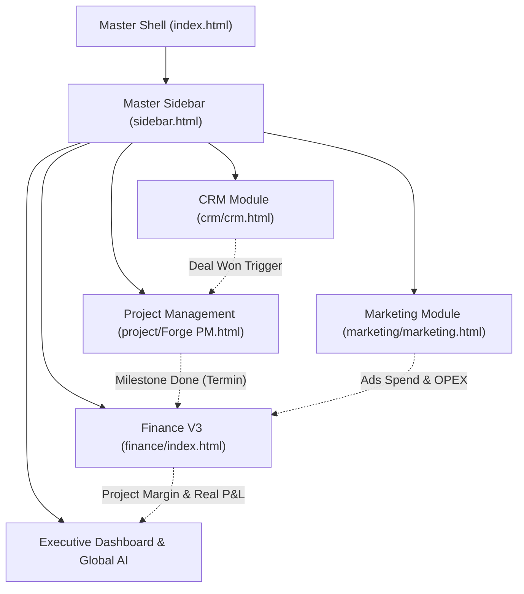
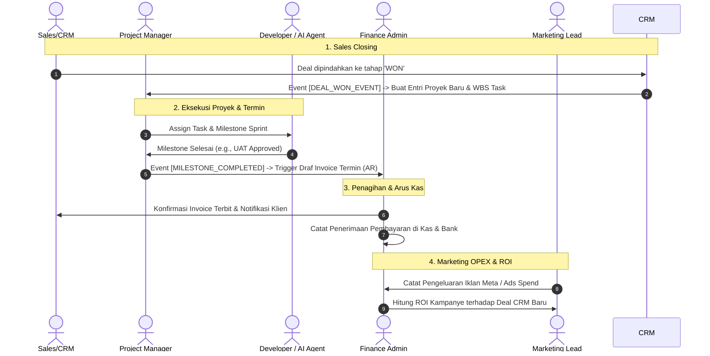

# MASTER PRODUCT REQUIREMENTS DOCUMENT (PRD)
# ASTACODE ERP — UNIFIED ENTERPRISE PLATFORM

| Metadata | Keterangan |
|---|---|
| **Dokumen** | Master Product Requirements Document (Master PRD) |
| **Produk** | Astacode ERP (Enterprise Operations Platform) |
| **Versi Dokumen** | 2.0 (Unified Master Architecture) |
| **Status** | Approved & Ready for Technical Implementation |
| **Disusun oleh** | Project Manager & Head of ERP Architecture |
| **Pemilik Produk** | Astacode |
| **Modul Terintegrasi** | CRM, Project Management (Forge PM), Finance V3, Marketing & AI Content Engine |

---

## DAFTAR ISI
1. [Ringkasan Eksekutif & Visi Produk](#1-ringkasan-eksekutif--visi-produk)
2. [Latar Belakang & Masalah Bisnis](#2-latar-belakang--masalah-bisnis)
3. [Tujuan Produk & Prinsip Pengembangan](#3-tujuan-produk--prinsip-pengembangan)
4. [Peta Arsitektur Navigasi Terpadu (Master Information Architecture)](#4-peta-arsitektur-navigasi-terpadu-master-information-architecture)
5. [Spesifikasi Master Sidebar Terpisah (`sidebar.html`)](#5-spesifikasi-master-sidebar-terpisah-sidebarhtml)
6. [Detail Fungsional per Modul Terintegrasi](#6-detail-fungsional-per-modul-terintegrasi)
   - 6.1 [Executive Suite & Global Orchestrator (`index.html`)](#61-executive-suite--global-orchestrator)
   - 6.2 [Modul CRM (`crm/crm.html`)](#62-modul-crm)
   - 6.3 [Modul Project Management & Automation Fix Bug (`project/Forge PM.html`)](#63-modul-project-management--automation-fix-bug)
   - 6.4 [Modul Finance V3 (`finance/index.html`)](#64-modul-finance-v3)
   - 6.5 [Modul Marketing & AI Content Engine (`marketing/marketing.html`)](#65-modul-marketing--ai-content-engine)
7. [Desain Sistem & Standarisasi Tema Warna](#7-desain-sistem--standarisasi-tema-warna)
8. [Jembatan Data Lintas Modul (Cross-Module Data Bridges)](#8-jembatan-data-lintas-modul-cross-module-data-bridges)
9. [Role-Based Access Control (RBAC) Matrix](#9-role-based-access-control-rbac-matrix)
10. [Rencana Implementasi & Roadmap](#10-rencana-implementasi--roadmap)

---

## 1. Ringkasan Eksekutif & Visi Produk

Astacode ERP adalah platform operasional terpadu (*Single Source of Truth*) yang menggabungkan 4 pilar utama bisnis software house Astacode:
1. **CRM**: Akuisisi prospek, negosiasi, otomasi quotation/MoU, hingga deal closing.
2. **Project Management (Forge PM)**: Manajemen proyek agile, tracking task, sprint backlog, monitoring workload tim, serta agen cerdas **Automation Fix Bug** (deteksi & resolusi bug otomatis via Pull Request).
3. **Finance V3**: Cash flow management, penagihan termin (AR), pembayaran operasional & vendor (AP), rekonsiliasi kas/bank, jurnal buku besar, serta analisis profitabilitas proyek riil.
4. **Marketing & AI Content Engine**: Riset tren topik, pembuatan konten otomatis (copy, visual, multi-channel), persetujuan berjenjang (*approval queue*), kalender konten visual, omnichannel inbox, dan analitik performa.

### Visi Penyatuan (Master Integration)
Sebelum integrasi, setiap modul berjalan secara terpisah dengan sidebar dan struktur navigasi masing-masing. Dokumen Master PRD ini menetapkan penyatuan navigasi menjadi **Satu Master Sidebar Terpadu** yang termuat secara modular melalui file independen (`sidebar.html`), bergaya tema korporat elegan (mengacu pada tema warna utama `index.html`), dengan kemampuan routing mulus antar modul tanpa merusak fitur, script, atau layout internal modul yang sudah ada.



---

## 2. Latar Belakang & Masalah Bisnis

| Area | Kondisi Sebelumnya (AS-IS) | Kondisi Solusi Terpadu (TO-BE) |
|---|---|---|
| **Navigasi Sistem** | Setiap folder (`crm/`, `finance/`, `marketing/`, `project/`) memiliki sidebar mandiri yang terputus satu sama lain. | **Satu Master Sidebar Universal** (`sidebar.html`) yang menyatukan seluruh hierarki menu & submenu. |
| **Aksesibilitas Halaman** | Pengguna harus manual membuka URL/file terpisah untuk beralih modul. | Akses sekali klik (*seamless routing*) langsung ke submenu spesifik di modul mana pun. |
| **Integritas Tampilan** | Resiko rusaknya styling lokal jika file digabung paksa dalam 1 HTML raksasa. | Arsitektur modular *loosely coupled*: tampilan lokal modul tetap 100% utuh dan orisinil. |
| **Konsistensi Visual** | Warna sidebar di setiap modul berbeda-beda. | Standardisasi palet warna master menggunakan tema utama `index.html` (Deep Navy & Royal Blue `#305BA3`). |
| **Keterhubungan Data** | Data sales, project, invoice, dan campaign terisolasi. | Terhubung melalui *data bridge* standar (`client_id`, `project_id`, `deal_id`, `invoice_id`). |

---

## 3. Tujuan Produk & Prinsip Pengembangan

### 3.1 Tujuan Utama
1. **Universal Navigation**: Seluruh menu dan submenu dari 4 modul dapat diakses langsung dari sidebar utama tanpa kehilangan konteks.
2. **Zero Regression**: Tidak ada satupun fitur, modal, chart, atau alur interaktif di CRM, PM, Finance, atau Marketing yang hilang atau berkurang.
3. **Modular File Separation**: File HTML sidebar utama (`sidebar.html`) dipisahkan secara bersih agar mudah di-maintain dan di-load secara dinamis.
4. **Theme Cohesion**: Mengadopsi tokens warna resmi dari `index.html`: `#305BA3` (Primary), `#0F172A` (Slate Navy Sidebar), dan `#38BDF8` (Accent Glow).
5. **Index as Orchestrator**: `index.html` berfungsi sebagai induk utama yang memanggil dan mengorkestrasi modul-modul tanpa membebani runtime browser.

---

## 4. Peta Arsitektur Navigasi Terpadu (Master Information Architecture)

Tabel berikut adalah master mapping seluruh hierarki menu yang disatukan ke dalam Master Sidebar:

| No | Modul / Grup Menu | Submenu | Target Route / Hash | Deskripsi Fungsional |
|---|---|---|---|---|
| **0** | **WORKSPACE** | | | |
| 0.1 | 📊 Executive Suite | **Executive Dashboard** | `index.html#dashboard` | Dashboard eksekutif single source of truth (CRM, PM, Finance, Marketing). |
| **1** | **CRM SUITE** | *(Accordion)* | `crm/crm.html` | Solusi end-to-end sales & pipeline akuisisi klien. |
| 1.1 | | Lead & Pipeline Kanban | `crm/crm.html#pipeline` | Manajemen pipeline interaktif drag-and-drop dengan filter & estimasi nilai. |
| 1.2 | | Quotation & MoU Studio | `crm/crm.html#quotation` | Otomasi generator penawaran, WBS kalkulator, termin pembayaran, & pratinjau A4. |
| 1.3 | | Master Customer (360°) | `crm/crm.html#customer` | Database klien lengkap dengan histori deal, kontak PIC, dan status tagihan. |
| 1.4 | | Master Data CRM | `crm/crm.html#master` | Konfigurasi rate card developer, formula margin, dan template klausul hukum. |
| 1.5 | | Revenue Forecast AI | `crm/crm.html#analytics` | Proyeksi pendapatan berbobot probabilitas & win-rate analitik. |
| **2** | **PROJECT MANAGEMENT** | *(Accordion)* | `project/Forge PM.html` | Platform manajemen proyek agile & deteksi bug otomatis. |
| 2.1 | | PM Dashboard | `project/Forge PM.html#dashboard` | Ikhtisar performa proyek aktif, velocity tim, dan status deadline. |
| 2.2 | | Projects Portfolio | `project/Forge PM.html#project` | Daftar seluruh proyek aktif, progres milestone, dan repositori dokumen. |
| 2.3 | | Tickets & Backlog | `project/Forge PM.html#tickets` | Kanban board tiket teknis, bug laporan klien, dan task sprint. |
| 2.4 | | My Tasks | `project/Forge PM.html#mytasks` | To-Do list personal developer/PM lengkap dengan time tracker terintegrasi. |
| 2.5 | | Automation Fix Bug | `project/Forge PM.html#automation` | Agen AI Claude untuk diagnosa error, scan log, dan generate PR perbaikan. |
| 2.6 | | Events & Schedule | `project/Forge PM.html#events` | Kalender jadwal rilis, demo klien, sprint review, dan milestone deadline. |
| 2.7 | | Knowledge Notes | `project/Forge PM.html#notes` | Dokumentasi arsitektur sistem, SOP teknis, dan catatan meeting. |
| 2.8 | | Team Workload | `project/Forge PM.html#team` | Matriks utilisasi kapasitas programmer dan alokasi sumber daya. |
| **3** | **FINANCE & AR/AP** | *(Accordion)* | `finance/index.html` | Pengelolaan keuangan enterprise, kas/bank, dan profitabilitas. |
| 3.1 | | Cash Flow Overview | `finance/index.html#view-dashboard` | Ringkasan saldo kas/bank real-time, tren kas masuk/keluar, dan cash runway. |
| 3.2 | | Pemasukan (AR & Termin) | `finance/index.html#view-penagihan` | Daftar invoice klien, status jatuh tempo termin, dan reminder penagihan. |
| 3.3 | | Pengeluaran (AP & Klaim) | `finance/index.html#view-klaim` | Manajemen klaim reimbers/struk, tagihan vendor/freelancer, dan payroll. |
| 3.4 | | Kas & Rekonsiliasi Bank | `finance/index.html#view-recon` | Rekening koran bank vs pencatatan sistem dengan validasi cepat. |
| 3.5 | | Buku Besar (GL & COA) | `finance/index.html#view-generic` | Chart of Accounts baku dan jurnal transaksi berpasangan. |
| 3.6 | | Profitabilitas Proyek | `finance/index.html#view-profit` | Analisis margin laba riil per proyek (Revenue vs Direct Cost & Hours). |
| **4** | **MARKETING & AI ENGINE**| *(Accordion)* | `marketing/marketing.html` | Orkestrasi pemasaran multi-channel berbasis AI. |
| 4.1 | | Marketing Ops | `marketing/marketing.html#view-marketing-ops` | Dashboard metrik jangkauan, interaksi sosial media, dan konversi kampanye. |
| 4.2 | | AI Content Engine | `marketing/marketing.html#view-ai-engine` | Studio pembuatan konten otomatis (copywriting, visual prompt, artikel blog). |
| 4.3 | | Antrean Persetujuan | `marketing/marketing.html#view-approval-queue` | Alur review konten sebelum terbit (Reviewer, Quality Score, Safeguard). |
| 4.4 | | Content Calendar | `marketing/marketing.html#view-calendar` | Kalender visual jadwal rilis konten mingguan & bulanan di berbagai kanal. |
| 4.5 | | Distribution Manager | `marketing/marketing.html#view-distribution` | Hub konektor integrasi Instagram Graph API, TikTok API, dan CMS Blog. |
| 4.6 | | Brand Asset Library | `marketing/marketing.html#view-asset-library` | Penyimpanan terpusat logo, template desain, font, dan pedoman brand voice. |
| 4.7 | | Social Listening | `marketing/marketing.html#view-social-listening` | Pemantauan tren kata kunci industri dan sentimen audiens. |
| 4.8 | | Omnichannel Inbox | `marketing/marketing.html#view-inbox` | Manajemen pesan masuk/komentar terpusat (DM Instagram, TikTok, Form Web). |
| 4.9 | | Riwayat Konten | `marketing/marketing.html#view-content-history` | Log historis performa seluruh konten yang sudah dipublikasikan. |
| **5** | **AI LINTAS MODUL** | | | |
| 5.1 | 🤖 Kanban AI Global | **Kanban AI Inbox** | `index.html#aikanban` | AI Copilot lintas divisi untuk trigger aksi cepat via perintah teks alami. |
| **6** | **CONTROL & CONFIG** | | | |
| 6.1 | 📈 Reporting | **Executive Reporting** | `index.html#analytics` | Laporan konsolidasi cross-department untuk jajaran direksi/owner. |
| 6.2 | 🔌 Integrasi | **Integrations Hub** | `index.html#integrations` | Manajemen webhook dan API keys (GitHub, Sentry, Meta, WhatsApp, Midtrans). |
| 6.3 | 🛡️ Akses & Audit | **Access & Audit (RBAC)**| `index.html#rbac` | Manajemen hak akses peran pengguna dan rekam jejak audit (*audit log*). |
| 6.4 | ⚙️ Pengaturan | **System Settings** | `index.html#settings` | Konfigurasi profil instansi, preferensi pajak (PPN), dan zona waktu. |

---

## 5. Spesifikasi Master Sidebar Terpisah (`sidebar.html`)

Sesuai kebutuhan Project Manager, markup Master Sidebar dipisahkan ke dalam file **`sidebar.html`** di root workspace.

### 5.1 Karakteristik File `sidebar.html`
1. **Independen & Self-Contained**: Memuat elemen semantic `<aside class="sidebar" id="sidebar">` yang mencakup brand logo, label grup, tombol navigasi utama, accordion submenu, dan panel profil pengguna.
2. **Path Agnostic**: Tag link dan routing dirancang kompatibel baik saat diakses dari root (`index.html`) maupun dari subdirektori (`crm/`, `finance/`, `marketing/`, `project/`) melalui controller `sidebar.js`.
3. **Accordion Behavior**: Submenu modul CRM, PM, Finance, dan Marketing dapat di-expand/collapse secara mulus dengan indikator chevron berputar dan border accent modern.

---

## 6. Detail Fungsional per Modul Terintegrasi

### 6.1 Executive Suite & Global Orchestrator (`index.html`)
- **Fungsi Utama**: Memberikan gambaran helikopter bagi Owner/PM atas performa seluruh departemen.
- **Komponen Kunci**:
  - 4 Executive KPI Cards: Pendapatan Bulan Ini, Proyek Aktif, Bug Diperbaiki AI, dan Konten Menunggu Review.
  - Revenue & Pipeline Projection Chart (12-Month Won vs Opportunity).
  - Lifecycle Sales to Cash Funnel (Leads → Prospects → Offering → Proposal → Won).
  - Sliding AI Assistant Panel (Kanban AI Copilot) untuk eksekusi perintah otomatis.

### 6.2 Modul CRM (`crm/crm.html`)
- **Fungsi Utama**: Mengakselerasi siklus penjualan dari lead hingga kesepakatan kontrak.
- **Fitur Terintegrasi**:
  - Pipeline Board Kanban drag-and-drop dengan kalkulasi probabilistik nilai deal.
  - AI PRD/BRD Scanner untuk konversi cepat dokumen requirement klien menjadi Work Breakdown Structure (WBS).
  - Document Studio dengan live generator penawaran (Quotation) & MoU siap cetak format resmi A4 lengkap dengan meterai digital dan stempel perusahaan.
  - Master Data Rate Card & Margin Preset.

### 6.3 Modul Project Management & Automation Fix Bug (`project/Forge PM.html`)
- **Fungsi Utama**: Manajemen eksekusi proyek dan penyelesaian issue teknis secara cerdas.
- **Fitur Terintegrasi**:
  - PM Overview ring progress & donut chart status tugas.
  - Sprint Backlog & Ticket Management dengan tagging prioritas (Kritis, Tinggi, Sedang).
  - **Automation Fix Bug (AFB)**:
    - AI Console yang memantau runtime error dari Sentry / Web Report.
    - Diagnosa akar masalah otomatis beserta kode diff (Before/After).
    - Mekanisme aman: Membutuhkan persetujuan PM/Lead Developer (*Approve PR*) sebelum perubahan di-deploy.
  - Milestone & Events Calendar.

### 6.4 Modul Finance V3 (`finance/index.html`)
- **Fungsi Utama**: Pengendalian arus kas, penagihan piutang, dan pencatatan akuntansi berstandar.
- **Fitur Terintegrasi**:
  - Cash Flow Overview & Visual Inflow/Outflow Curves.
  - Modul Piutang (AR): Monitoring invoice termin proyek yang terbit dari milestone PM.
  - Modul Hutang & Pengeluaran (AP): Verifikasi klaim struk OCR, invoice vendor freelancer, dan alokasi payroll.
  - Rekonsiliasi Bank cerdas dengan pencocokan transaksi otomatis.
  - Profitabilitas Proyek riil: Perhitungan laba bersih per proyek berdasarkan biaya langsung dan jam kerja dev.

### 6.5 Modul Marketing & AI Content Engine (`marketing/marketing.html`)
- **Fungsi Utama**: Pertumbuhan brand Astacode melalui otomasi konten organik dan iklan.
- **Fitur Terintegrasi**:
  - Marketing Operations Dashboard dengan visualisasi distribusi platform (Instagram, TikTok, Blog).
  - AI Content Generation Studio dengan prompt engine topik teknologi & software development.
  - Antrean Persetujuan berjenjang dengan evaluasi Quality Score & Brand Voice Safeguard.
  - Kalender Konten Interaktif mingguan/bulanan.
  - Omnichannel Customer Inbox untuk merespons prospek dari media sosial.

---

## 7. Desain Sistem & Standarisasi Tema Warna

Seluruh sidebar dan elemen master menu mengadopsi standar desain visual `index.html`:

```css
:root {
  /* Brand Primary Colors */
  --primary: #305BA3;           /* Astacode Royal Blue */
  --primary-2: #264A85;         /* Deep Blue Hover */
  --primary-soft: #E8EEF7;      /* Subtle Blue Background */
  --primary-glow: rgba(48, 91, 163, 0.15);

  /* Background & Surfaces */
  --bg: #F4F7FB;                /* Soft Canvas Background */
  --surface: #FFFFFF;           /* Pure White Surface */
  --surface-2: #F8FAFC;         /* Light Gray Neutral */
  --border: #E2E8F0;            /* Crisp Border Line */

  /* Master Sidebar Theme (Deep Slate Corporate) */
  --sidebar-bg-1: #0F172A;      /* Midnight Slate Dark */
  --sidebar-bg-2: #0B1324;      /* Deep Abyss Navy */
  --sidebar-text: #CBD5E1;      /* Crisp Legible White-Blue */
  --sidebar-muted: #64748B;     /* Muted Label Slate */
  --sidebar-accent: #305BA3;    /* Primary Brand Blue */
  --sidebar-accent-light: #38BDF8; /* Sky Blue Highlight & Active Glow */
  --sidebar-hover: rgba(255, 255, 255, 0.06);
  --sidebar-border: rgba(255, 255, 255, 0.08);

  /* Status Colors */
  --success: #10B981;           /* Emerald Green */
  --warning: #F59E0B;           /* Amber Gold */
  --danger: #EF4444;            /* Coral Red */
  --info: #3B82F6;              /* Cerulean Blue */

  /* Typography */
  --font-family: 'Inter', -apple-system, BlinkMacSystemFont, 'Segoe UI', Roboto, sans-serif;
}
```

---

## 8. Jembatan Data Lintas Modul (Cross-Module Data Bridges)

Integrasi antar modul diikat melalui payload data standar yang saling memicu aksi otomatis:



### Kontrak Data Bridge Utama:
1. **Deal Won Payload (`CRM -> PM`)**:
   `{ deal_id, client_id, project_name, contract_value, wbs_items, start_date, target_end_date }`
2. **Invoice Trigger Payload (`PM -> Finance`)**:
   `{ project_id, client_id, termin_number, milestone_name, percentage, amount, due_date }`
3. **Expense / AP Payload (`Marketing/PM -> Finance`)**:
   `{ department: "Marketing"|"PM", expense_type, amount, receipt_url, project_id (optional), status }`
4. **Bug Diagnostic Payload (`Sentry/Client -> PM AFB`)**:
   `{ issue_id, error_name, stack_trace, suggested_diff, status: "WAITING_APPROVAL" }`

---

## 9. Role-Based Access Control (RBAC) Matrix

| Modul & Fitur | Owner / Direksi | Project Manager | Developer / Tech Lead | Finance | Sales / BD | Marketing |
|---|:---:|:---:|:---:|:---:|:---:|:---:|
| **Executive Dashboard** | Full | Full | View | View | View | View |
| **CRM Pipeline & Quotation** | Full | View | - | View | Full | View |
| **Project Management** | Full | Full | Full | View | View | - |
| **Automation Fix Bug (Approve)**| Full | Full | Full | - | - | - |
| **Finance (AR/AP/Bank)** | Full | View | - | Full | - | - |
| **Marketing & AI Engine** | Full | View | - | View | View | Full |
| **Access & Audit Log** | Full | View | - | - | - | - |

---

## 10. Rencana Implementasi & Roadmap

| Fase | Durasi | Sasaran & Deliverables | Status |
|---|---|---|---|
| **Fase 1: Master PRD & Desain Navigasi** | Hari 1 | Pembuatan Master PRD resmi, restrukturisasi skema menu, dan standardisasi tema warna. | **COMPLETED** |
| **Fase 2: Pemisahan Master Sidebar (`sidebar.html`)** | Hari 1 | Ekstraksi file HTML modular untuk master sidebar, update `sidebar.css` & controller `sidebar.js`. | **COMPLETED** |
| **Fase 3: Integrasi Seluruh Modul** | Hari 1-2 | Pemasangan hook master sidebar pada `index.html`, `crm/crm.html`, `finance/index.html`, `marketing/marketing.html`, dan `project/Forge PM.html`. | **READY** |
| **Fase 4: Verifikasi Aksesibilitas & Validasi** | Hari 2 | Pengujian lintas browser untuk memastikan seluruh halaman, routing hash, dan fitur internal berjalan 100% mulus tanpa error. | **READY** |

---
*Disetujui dan disahkan untuk implementasi teknis platform Astacode ERP.*
