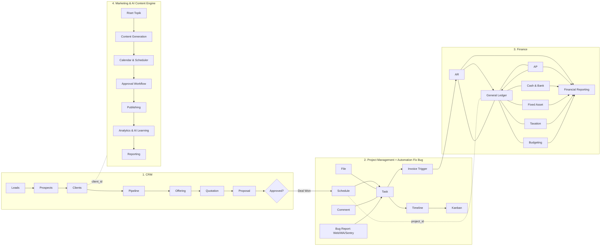
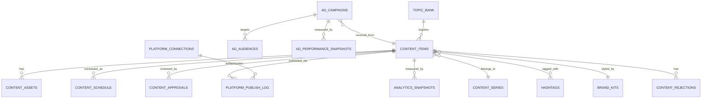
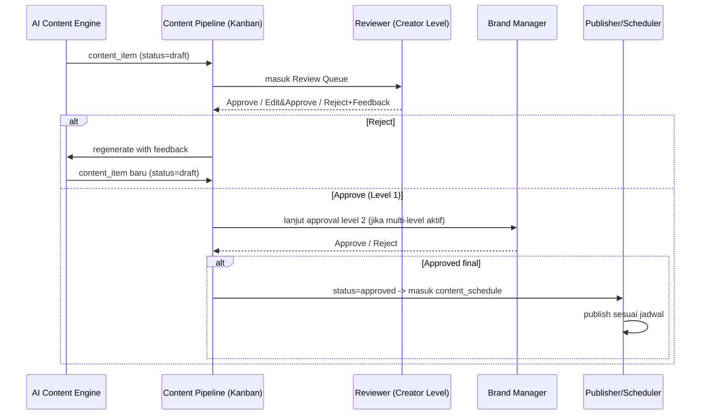

# PRD — Astacode ERP
**Enterprise Resource Planning untuk Software House Astacode**

| | |
|---|---|
| **Dokumen** | Product Requirements Document (PRD) |
| **Produk** | Astacode ERP |
| **Versi Dokumen** | 1.0 (Draft Konsolidasi) |
| **Status** | Draft — untuk direview & dikembangkan lanjut |
| **Disusun oleh** | Head of ERP (AI Product/Business/System Lead) |
| **Pemilik Produk** | Astacode |
| **Timeline Acuan** | MVP dalam kurang lebih 3 bulan, dilanjutkan Post-MVP bertahap |

---

## Daftar Isi

1. [Ringkasan Eksekutif](#1-ringkasan-eksekutif)
2. [Latar Belakang & Masalah Bisnis](#2-latar-belakang--masalah-bisnis)
3. [Tujuan Produk](#3-tujuan-produk)
4. [Prinsip & Batasan Pengembangan](#4-prinsip--batasan-pengembangan)
5. [Target Pengguna & Role](#5-target-pengguna--role)
6. [Arsitektur Modul (Peta Sistem)](#6-arsitektur-modul-peta-sistem)
7. [Modul 1 — CRM](#7-modul-1--crm)
8. [Modul 2 — Project Management & Automation Fix Bug](#8-modul-2--project-management--automation-fix-bug)
9. [Modul 3 — Finance](#9-modul-3--finance)
10. [Modul 4 — Marketing & AI Content Engine](#10-modul-4--marketing--ai-content-engine)
11. [Modul 5 — Kanban AI (Lintas Modul)](#11-modul-5--kanban-ai-lintas-modul)
12. [Integrasi Antar Modul (Data Bridge)](#12-integrasi-antar-modul-data-bridge)
13. [Desain Sistem & UI/UX Guidelines](#13-desain-sistem--uiux-guidelines)
14. [Arsitektur Teknis & Tech Stack](#14-arsitektur-teknis--tech-stack)
15. [Kebutuhan Non-Fungsional](#15-kebutuhan-non-fungsional)
16. [Role-Based Access Control (RBAC)](#16-role-based-access-control-rbac)
17. [Klasifikasi MVP / Post-MVP / Future / Out of Scope](#17-klasifikasi-mvp--post-mvp--future--out-of-scope)
18. [Roadmap & Fase Pengembangan](#18-roadmap--fase-pengembangan)
19. [Metrik Keberhasilan (Success Metrics)](#19-metrik-keberhasilan-success-metrics)
20. [Risiko & Mitigasi](#20-risiko--mitigasi)
21. [Open Questions / Perlu Divalidasi](#21-open-questions--perlu-divalidasi)
22. [Glosarium](#22-glosarium)

---

## 1. Ringkasan Eksekutif

Astacode ERP adalah platform internal berkelas industri yang dirancang untuk menyatukan seluruh operasional software house Astacode — mulai dari akuisisi klien (CRM), eksekusi proyek (Project Management + Automation Fix Bug berbasis AI), pengelolaan keuangan (Finance), hingga pertumbuhan bisnis melalui konten dan iklan digital (Marketing & AI Content Engine) — dalam satu sumber kebenaran (*single source of truth*).

Saat ini proses berjalan tersebar di banyak tools (WhatsApp, Excel, Trello, Canva, dokumen manual) sehingga menyebabkan data terpisah, follow-up terlewat, status proyek tidak transparan, serta pelaporan keuangan dan pemasaran yang manual dan rawan human error.

Astacode ERP dibangun sebagai **modular monolith** (Laravel + Inertia + Vue) dengan empat pilar modul utama:

1. **CRM** — Leads → Prospects → Clients → Pipeline → Offering → Quotation → Proposal → Approval → serah terima ke Project Management.
2. **Project Management (PM) + Automation Fix Bug** — Schedule, Task, Timeline, Kanban, File, Comment, Invoice; dilengkapi agen AI (Claude) untuk deteksi & perbaikan bug otomatis melalui alur Pull Request yang tetap memerlukan persetujuan manusia.
3. **Finance** — General Ledger, AR, AP, Cash & Bank, Fixed Asset, Taxation, Budgeting/Costing, Financial Reporting — terhubung langsung ke CRM & PM lewat `client_id`, `project_id`, `deal_id`.
4. **Marketing & AI Content Engine** — Riset topik, generate konten (teks, visual, video), kalender & scheduler, approval workflow berjenjang, publishing multi-platform (Instagram, TikTok, Blog), Meta Ads automation, Analytics & AI Learning, Reporting.

Karena jendela pengembangan MVP realistis (±3 bulan), dokumen ini secara eksplisit mengklasifikasikan setiap fitur ke dalam **MVP / Post-MVP / Future / Out of Scope** (lihat Bab 17) agar tim tidak terjebak scope creep, sambil tetap menjaga visi besar "ERP sekelas industri" sebagai peta jalan jangka panjang.

---

## 2. Latar Belakang & Masalah Bisnis

### 2.1 Kondisi Saat Ini (AS-IS)

| Area | Kondisi Saat Ini | Dampak |
|---|---|---|
| CRM / Sales | Leads & follow-up dicatat manual (chat, spreadsheet) | Leads hilang, follow-up telat, tidak ada visibilitas pipeline |
| Proposal & Quotation | Dibuat manual dari template dokumen | Tidak konsisten, lambat, rawan salah harga/termin |
| Project Handoff | Tidak ada alur baku dari deal disetujui → proyek jalan | Miskomunikasi scope, task tercecer |
| Bug Handling | Klien lapor via telepon/WhatsApp tanpa struktur | Tidak terlacak, waktu respon tidak terukur, rawan human error saat deploy manual |
| Project Tracking | Kanban/Trello terpisah dari data klien & keuangan | Progres proyek tidak terhubung ke invoice |
| Finance | Pencatatan manual (Excel), belum terhubung ke proyek | Piutang macet tidak kelihatan, laba per proyek tidak terukur |
| Marketing/Konten | Konten dibuat manual satu per satu, jadwal tidak konsisten | Growth lambat, tidak ada data untuk keputusan konten |

### 2.2 Kebutuhan Bisnis (TO-BE)

Astacode membutuhkan satu platform yang:
- Menyatukan data klien, proyek, keuangan, dan pemasaran.
- Memberi visibilitas real-time atas status setiap deal, proyek, tagihan, dan konten.
- Mengotomasi pekerjaan berulang (follow-up, perbaikan bug ringan, publishing konten) tanpa menghilangkan kendali manusia pada keputusan penting.
- Menghasilkan data finansial yang auditable dan laporan yang bisa diandalkan untuk pengambilan keputusan.

---

## 3. Tujuan Produk

### 3.1 Tujuan Utama
1. Menyediakan **single source of truth** untuk seluruh siklus bisnis: leads → deal → proyek → invoice → laporan keuangan → pertumbuhan marketing.
2. Mempercepat proses sales-to-cash: dari leads masuk hingga invoice terbayar.
3. Mempercepat deteksi & perbaikan bug pada web klien tanpa mengorbankan keamanan (via agen AI + human approval).
4. Memberikan laporan keuangan per proyek (profitabilitas riil) secara otomatis, bukan manual.
5. Mengotomasi produksi & distribusi konten marketing untuk mempercepat growth dengan tetap menjaga kualitas dan brand voice.
6. Menjadi platform yang bisa terus dikembangkan tanpa perlu dibangun ulang (arsitektur modular, data model yang saling terhubung sejak awal).

### 3.2 Tujuan yang Eksplisit Bukan Bagian MVP
- Sistem **tidak** melakukan deploy otomatis ke production tanpa persetujuan manusia.
- Sistem **tidak** menjamin semua bug bisa diperbaiki otomatis; kategori *hard* tetap butuh keputusan manusia.
- Sistem **tidak** menggantikan kebutuhan automated test dasar pada proyek klien.
- Modul Marketing berskala penuh (Meta Ads automation, AI Learning Loop, video automation penuh) **tidak** ditargetkan selesai di MVP — lihat Bab 17 & 18.

---

## 4. Prinsip & Batasan Pengembangan

Mengacu pada prinsip *Head of ERP*, pengembangan produk ini tunduk pada aturan berikut:

1. **Business First** — setiap fitur harus menjawab: masalah apa yang diselesaikan, siapa penggunanya, seberapa sering dipakai, apa yang terjadi jika otomasi gagal.
2. **Evidence Before Assumption** — aturan pajak, kapabilitas API pihak ketiga (Meta, TikTok, WhatsApp, Sentry), dan ketentuan legal **tidak diasumsikan**; ditandai `[PERLU VALIDASI]` bila belum dikonfirmasi sumber resmi.
3. **Simple Architecture First** — modular monolith (Laravel) dipilih dibanding microservices karena tim kecil dan timeline 3 bulan.
4. **MVP Protection** — setiap fitur besar (khususnya Marketing & Automation Fix Bug) wajib diklasifikasikan MVP/Post-MVP/Future/Out of Scope agar tidak mengorbankan sistem inti yang bekerja.
5. **Security & Auditability by Design** — semua transaksi keuangan dan aksi AI-generated wajib tercatat log waktu & pelaku (`*_events` / `audit_log`).

---

## 5. Target Pengguna & Role

| Role | Deskripsi | Kebutuhan Utama |
|---|---|---|
| **Owner / Direksi** | Pemilik Astacode | Dashboard eksekutif, laba per proyek, cash flow, growth marketing |
| **Sales / Business Development** | Mengelola leads sampai deal closing | Pipeline CRM, quotation cepat, reminder follow-up |
| **Project Manager** | Mengelola eksekusi proyek | Kanban, timeline, assign task, tracking progres |
| **Programmer / Developer** | Mengerjakan task, review PR dari agen AI | Task detail, diagnostic package, approve/reject PR |
| **Finance / Admin Keuangan** | Mengelola invoice, AR/AP, pajak | AR/AP dashboard, jurnal otomatis, laporan keuangan |
| **Marketing / Content Specialist** | Mengelola konten & campaign | Content calendar, review queue, analytics |
| **Klien (eksternal)** | Melapor bug, melihat status proyek & invoice | Portal klien minimal (status, laporan bug, invoice) |
| **Agen AI (Claude)** | Aktor sistem non-manusia | Akses terbatas via MCP tools + allow-list |

---

## 6. Arsitektur Modul (Peta Sistem)



**Kunci relasi lintas modul:** `client_id`, `project_id`, `deal_id` — didefinisikan sejak awal di tabel dasar agar setiap modul baru tinggal disambungkan (lihat Bab 12).

---

## 7. Modul 1 — CRM

### 7.1 Alur Utama (Pipeline)

```
Leads → Prospects → Clients → Pipeline → Offering → Quotation → Proposal → Approval → (masuk ke Project Management)
```

Disertai proses pendukung: **Follow-ups**, **Client Activity**, **Onboarding**, **Client History**, **Termin/Set Termin**.

### 7.2 Deskripsi Tahapan

| Tahap | Deskripsi | Output |
|---|---|---|
| **Leads** | Calon klien mentah dari berbagai kanal (form web, WhatsApp, referral, ads) | `lead` record dengan sumber & status kualifikasi |
| **Prospects** | Leads yang sudah dikualifikasi (ada kebutuhan jelas, budget indikatif) | `prospect` terhubung ke `lead_id` |
| **Clients** | Prospect yang sudah pernah closing minimal 1 deal | `client` master record |
| **Pipeline** | Tahapan deal: New → Qualified → Needs Analysis → Offering Sent → Negotiation → Won/Lost | `deal` dengan `stage`, `probability`, `expected_close_date` |
| **Offerings** | Penawaran solusi/paket ke klien berdasar kebutuhan | `offering` dengan item layanan & estimasi harga |
| **Proposals** | Dokumen proposal resmi (bisa PDF) berisi scope, timeline, harga | `proposal` versi & status |
| **Quotation** | Rincian harga final, term pembayaran (**termin**) | `quotation` diturunkan dari offering yang disetujui |
| **Follow-ups** | Aktivitas tindak lanjut terjadwal (call, meeting, email) | `follow_up` dengan reminder |
| **Client Activity** | Log seluruh interaksi dengan klien | `activity_log` (timeline aktivitas) |
| **Onboarding** | Proses awal setelah deal won (kickoff meeting, data teknis) | `onboarding_checklist` |
| **Client History** | Riwayat proyek, invoice, komunikasi klien secara konsolidasi | View agregat lintas modul |

### 7.3 Termin & Set Termin

- **Set Termin**: admin/sales menentukan skema pembayaran per quotation, mis. DP 30% – Progress 40% – Serah Terima 30%.
- Setiap termin punya: `termin_name`, `percentage_or_amount`, `trigger_condition` (mis. "saat UAT selesai"), `due_offset_days`.
- Termin inilah yang nanti menjadi acuan `milestone_name` di modul Finance → AR (lihat Bab 9.2).

### 7.4 Quotation → Generate Otomatis dari Offering

**Alur:** Offering disusun & di-*review* internal → offering dikirim ke klien → **jika disetujui**, sistem men-*generate* Quotation resmi secara otomatis dari data offering (item, harga, termin) → Quotation di-approve klien → status `deal.stage = Won` → **trigger otomatis** pembuatan Project baru di modul PM dengan data awal (client_id, deal_id, scope dari offering, termin dari quotation menjadi acuan jadwal invoice).

### 7.5 Data Model — Ringkasan Entitas CRM

| Entitas | Field Kunci |
|---|---|
| `leads` | id, source, name, contact, status, assigned_to, created_at |
| `prospects` | id, lead_id, qualification_notes, budget_estimate, status |
| `clients` | id, prospect_id (nullable), company_name, industry, pic_name, pic_contact, npwp |
| `deals` (pipeline) | id, client_id, stage, value_estimate, probability, expected_close_date, owner_id |
| `offerings` | id, deal_id, items(json), total_estimate, status (draft/sent/approved/rejected) |
| `quotations` | id, offering_id, quotation_number, items, subtotal, tax, total, valid_until, status |
| `quotation_termins` | id, quotation_id, termin_name, percentage, amount, trigger_condition, due_offset_days |
| `proposals` | id, deal_id, version, file_path, status, sent_at |
| `follow_ups` | id, client_id/deal_id, type (call/email/meeting), scheduled_at, status, notes |
| `client_activities` | id, client_id, activity_type, description, actor_id, created_at |
| `onboarding_checklists` | id, client_id, project_id, item, is_completed, completed_at |

### 7.6 User Stories Kunci

- *Sebagai Sales*, saya ingin mencatat leads baru dari berbagai kanal dalam satu form, agar tidak ada leads yang hilang.
- *Sebagai Sales*, saya ingin sistem mengingatkan follow-up yang jatuh tempo, agar tidak ada prospek yang terlewat.
- *Sebagai Sales*, saya ingin quotation ter-generate otomatis dari offering yang disetujui, agar tidak perlu input ulang manual.
- *Sebagai Owner*, saya ingin melihat pipeline value per tahap, agar bisa memprediksi revenue bulan depan.
- *Sebagai PM*, saya ingin project baru otomatis dibuat begitu quotation disetujui klien, agar tidak ada jeda antara deal closing dan eksekusi.

### 7.7 Acceptance Criteria (contoh — Quotation Auto-Generate)

- **Given** sebuah `offering` berstatus `approved`,
- **When** user menekan tombol "Generate Quotation",
- **Then** sistem membuat `quotation` baru dengan item & harga identik dengan offering, nomor quotation otomatis (format `QUO/YYYY/MM/0001`), dan status awal `draft`.
- **And** perubahan harga di quotation setelah generate tidak mengubah data offering asli (snapshot, bukan reference live).

---

## 8. Modul 2 — Project Management & Automation Fix Bug

### 8.1 Alur PM (Baku)

```
Schedule → Task → Timeline → Kanban → File → Comment → Invoice
```

### 8.2 Latar Belakang Kebutuhan

Penanganan bug pada web klien saat ini manual (klien lapor via telepon/WhatsApp tanpa struktur), perbaikan dikerjakan tanpa alur persetujuan konsisten, dan tidak ada satu tempat untuk melacak status, jadwal, file, diskusi, dan tagihan per proyek. Modul ini menyatukan dua kebutuhan:

1. **Automation Fix Bug** — agen AI (Claude Code headless) mendeteksi, menganalisis, dan memperbaiki bug via Pull Request dengan persetujuan manusia wajib.
2. **Project Manager** — mengelola seluruh pekerjaan (fitur, revisi, bug) dalam satu sistem.

### 8.3 Tujuan Sub-Modul Ini

- Mempercepat deteksi & perbaikan bug tanpa mengorbankan keamanan/kualitas kode.
- Satu sumber kebenaran status pekerjaan (manual maupun AI).
- Transparansi progres (kapan status terakhir diperbarui) untuk owner dan klien.
- Setiap perubahan kode hasil AI **wajib** ditinjau & disetujui manusia sebelum production.
- Tersedia jalur manual bagi programmer, lengkap data diagnostik dari agen.

**Bukan bagian sistem ini:** deploy otomatis tanpa approval; jaminan semua bug otomatis fixable (kategori *hard* tetap manual); menggantikan kebutuhan test dasar (project tanpa test dasar harus disiapkan dulu sebelum masuk jalur otomatis penuh).

### 8.4 Lingkup Fitur

#### 8.4.1 Automation Fix Bug (5 Pilar)

| Pilar | Deskripsi |
|---|---|
| **Monitoring** | Deteksi error otomatis via Sentry (per project, bertahap) + laporan manual (web/WhatsApp) |
| **Deploy** | CI/CD via GitHub Actions: test otomatis pada PR → deploy staging → production setelah approve, dengan rollback otomatis jika error rate naik |
| **Fix Bug** | Agen (Claude Code headless): clone repo → analisis akar masalah → patch minimal → tulis & jalankan test → buka Pull Request |
| **Manajemen Project** | Tracking status task, prioritas (hotfix vs biasa), riwayat perubahan status |
| **Progres/Status Update** | Setiap perubahan status tercatat di `task_events` dengan waktu, sehingga "progres terakhir" selalu akurat |

**Kategori Tingkat Kesulitan Bug** (ditentukan agen sebelum bekerja):

| Kategori | Kriteria | Approval |
|---|---|---|
| **Low** | Tidak menyentuh data/auth/pembayaran, test mudah dibuat | 1x approval |
| **Medium** | Beberapa file, logika bisnis, masih dalam 1 fitur | 1x approval |
| **Hard** | Migrasi database, pembayaran, autentikasi, atau agen tidak yakin akar masalah / berpotensi merambat ke sistem lain | **Konfirmasi ganda (double approval)** |

Semua kategori **wajib** persetujuan manusia sebelum deploy.

**Jalur perbaikan manual:** jika programmer memilih memperbaiki sendiri, agen menyiapkan *diagnostic package* (ringkasan masalah, lokasi kode terkait, log/stack trace, percobaan sebelumnya, saran opsi perbaikan) dan menyiapkan branch kerja, tanpa memaksakan patch otomatis.

#### 8.4.2 Project Manager Core

| Fitur | Deskripsi |
|---|---|
| **Schedule** | Kalender deadline, meeting, jadwal rilis per project |
| **Task** | Unit kerja (fitur/bug/revisi) — satu tabel untuk semua tipe pekerjaan, dibedakan kolom `type` |
| **Timeline** | Tampilan Gantt dari task & schedule (turunan dari SDLC yang ditentukan saat offering disetujui) |
| **Kanban** | Papan status drag-and-drop, dipakai bersama task manual & tiket bug otomatis |
| **File** | Lampiran per project/task (dokumen, desain, screenshot bug) |
| **Comment** | Diskusi per task, termasuk log aktivitas otomatis dari agen AI |
| **Invoice** | Tagihan per project, disusun dari task selesai / termin quotation, diekspor PDF |

#### 8.4.3 Kanal Masuk Laporan Bug

| Kanal | Detail |
|---|---|
| **Web Dashboard** | Form dengan dropdown pemilihan project (paling akurat) |
| **WhatsApp** | Format wajib `#KODE-PROJECT deskripsi`; tanpa kode, bot bertanya balik |
| **Sentry (otomatis)** | DSN unik per project → pencocokan otomatis tanpa ambiguitas |

#### 8.4.4 Antarmuka Teknis (MCP Layer)

Lapisan **MCP Server** menyediakan tools terstruktur (`list_tasks`, `update_task_status`, `create_branch_and_pr`, `add_comment`, dst.) agar agen AI berinteraksi langsung dengan data sistem, bukan hanya via teks bebas di prompt. Semua tools dibatasi **allow-list** (lihat Bab 15 Keamanan).

### 8.5 Alur Kerja Utama (End-to-End)

```
Laporan masuk (Web / WA / Sentry)
  → Task dibuat (type=bug, status=baru)
  → Antre di Queue → status=dianalisis
  → Agen: clone repo → analisis → kategori kesulitan ditentukan
      ├─ Bisa diperbaiki agen → patch + test → PR dibuka → status=menunggu_persetujuan
      └─ Programmer pilih perbaiki sendiri → diagnostic package disiapkan
  → Notifikasi ke programmer (ringkasan, kategori, diff, hasil test)
  → Programmer: Setujui / Tolak / Perbaiki sendiri
  → (Setujui) Merge PR → GitHub Actions deploy (staging → production)
  → Monitoring pasca-deploy → rollback otomatis bila error rate naik
  → status=selesai → tercatat di task_events → siap masuk Invoice
```

### 8.6 Entitas Data Inti

| Entitas | Field Kunci |
|---|---|
| `projects` | id, client_id, deal_id, name, sdlc_stage, sentry_dsn, repo_url, status |
| `tasks` | id, project_id, type (feature/bug/revision), source (web/wa/sentry/manual), title, description, difficulty_category, priority, status, assigned_to, created_at |
| `task_events` | id, task_id, event_type, actor_type (human/system), actor_id, from_status, to_status, notes, created_at |
| `schedules` | id, project_id, title, type (deadline/meeting/release), start_at, end_at |
| `files` | id, project_id, task_id (nullable), file_path, uploaded_by, created_at |
| `comments` | id, task_id, body, is_ai_generated, author_id/agent, created_at |
| `pull_requests` | id, task_id, pr_url, diff_summary, test_result, difficulty_category, approval_status |
| `invoices` (PM-side) | id, project_id, client_id, generated_from (task_ids/termin_id), total, status → sinkron ke Finance AR |

### 8.7 Feature Design — Contoh: Fix Bug oleh Agen AI

```
Feature: Automated Bug Fix via AI Agent
Problem: Bug ringan/menengah memakan waktu manual padahal polanya repetitif.
Goal: Mempercepat time-to-PR tanpa mengorbankan keamanan.
Users: Programmer/Owner (approver), Agen AI (executor)

MVP: Alur bug report manual (Web+WA) → task → notifikasi manual ke programmer (tanpa agen AI otomatis)
Post-MVP: Integrasi Sentry otomatis + agen AI analisis & patch untuk kategori Low
Future: Kategori Medium/Hard otomatis, rollback otomatis, learning loop dari histori fix
Out of Scope: Deploy tanpa approval manusia (selamanya, bukan hanya MVP)

User Story: Sebagai Programmer, saya ingin menerima PR siap review beserta hasil test dan
kategori kesulitan, agar saya bisa memutuskan approve/reject dengan cepat dan aman.

Acceptance Criteria:
- PR tidak pernah di-merge otomatis oleh sistem.
- Kategori "hard" wajib 2 approval berbeda sebelum merge.
- Setiap keputusan approve/reject tercatat di task_events dengan actor & waktu.

Business Rules:
- Agen hanya bekerja di folder hasil clone repo, tidak pernah menyentuh server production.
- Token GitHub dibatasi per repo terdaftar (fine-grained/GitHub App).

Database Impact: tasks, task_events, pull_requests
Security Impact: allow-list tools MCP, isi laporan bug diperlakukan sebagai data (mitigasi prompt injection)
Testing: PR wajib menyertakan test yang mereproduksi bug sebelum dianggap valid
Dependencies: GitHub Actions, Sentry, MCP Server
Risks: agen memperbaiki hal yang salah → mitigasi: test wajib + review manusia
Definition of Done: PR ter-generate, notifikasi terkirim, approve/reject berfungsi, log lengkap
```

---

## 9. Modul 3 — Finance

> Seluruh sub-modul Finance terhubung ke CRM & PM melalui `client_id`, `project_id`, `deal_id` (lihat Bab 12).

### 9.1 General Ledger & Core Accounting (Buku Besar)

**Fungsi:** mencatat seluruh mutasi debit-kredit dari semua transaksi secara otomatis (tidak manual per modul).

| Field | Deskripsi |
|---|---|
| `journal_entry_id` | ID entri jurnal |
| `journal_date` | Tanggal pencatatan transaksi |
| `source_module` | Asal transaksi: AR, AP, Kas & Bank, Aset, atau Penyesuaian Manual |
| `account_code` | Kode akun/COA (mis. `1-11200` Bank, `4-11000` Pendapatan Proyek) |
| `project_id` | Label proyek penanda transaksi |
| `debit_amount` / `credit_amount` | Nilai debit/kredit |
| `transaction_notes` | Keterangan memo transaksi |

**Prasyarat:** Chart of Accounts (COA) standar harus ditetapkan sebelum GL aktif — `[PERLU VALIDASI: struktur COA final bersama akuntan/konsultan pajak]`.

### 9.2 Accounts Receivable (AR / Piutang Usaha)

**Fungsi:** mengelola penagihan termin proyek & maintenance klien.

| Field | Deskripsi |
|---|---|
| `invoice_id`, `invoice_number` | ID & nomor faktur penagihan |
| `project_id`, `client_id` | Relasi proyek & klien |
| `billing_type` | Milestone/Termin Proyek atau Maintenance SLA |
| `milestone_name` | Nama termin (mis. DP 30%, UAT 40%, Serah Terima 30%) — **ditarik langsung dari `quotation_termins` di CRM** |
| `sla_billing_period` | Periode maintenance |
| `subtotal_amount`, `tax_amount`, `withholding_tax_amount`, `total_invoice_amount` | Rincian nilai tagihan |
| `due_date` | Batas waktu pembayaran |
| `payment_status` | Belum Bayar / Dibayar Sebagian / Lunas / Terlambat |

**Alur otomatis:** task selesai di PM (sesuai termin) → sistem menyiapkan draft invoice AR dari `quotation_termins` terkait → finance verifikasi → invoice terbit → klien bayar → status update → jurnal GL otomatis terbentuk.

### 9.3 Accounts Payable (AP / Utang Usaha)

**Fungsi:** mengelola tagihan vendor cloud, lisensi tools, fee freelancer.

| Field | Deskripsi |
|---|---|
| `bill_id`, `bill_number` | ID & nomor nota pihak ketiga |
| `vendor_name` | AWS, Midtrans, freelancer, dll. |
| `project_id` | Kosong jika untuk operasional umum kantor |
| `expense_category` | Cloud/Server, Freelancer, Lisensi API, Sewa Kantor |
| `bill_amount`, `bill_due_date` | Nominal & jatuh tempo |
| `payment_status` | Menunggu Persetujuan / Siap Bayar / Lunas |
| `bill_attachment` | File foto/PDF nota |

### 9.4 Cash & Bank Management

**Fungsi:** memantau saldo riil rekening operasional & kas kecil.

| Field | Deskripsi |
|---|---|
| `cash_transaction_id` | ID mutasi kas/bank |
| `bank_account_name` | BCA Operasional, Kas Kecil, dll. |
| `transaction_direction` | Uang Masuk / Uang Keluar |
| `reference_type`, `reference_id` | Terhubung ke Invoice AR atau Bill AP |
| `amount_transferred`, `bank_admin_fee` | Nominal & biaya transfer/payment gateway |
| `bank_statement_date` | Tanggal rekening koran |

### 9.5 Fixed Asset Management

**Fungsi:** mengelola laptop dev, workstation, perangkat kantor & penyusutannya.

| Field | Deskripsi |
|---|---|
| `asset_code`, `asset_name` | Mis. `AST-DEV-001`, MacBook Pro M3 |
| `assigned_employee` | Pemegang unit |
| `purchase_date`, `purchase_price` | Tanggal & harga beli |
| `useful_life_months` | Mis. 48 bulan |
| `monthly_depreciation_cost` | Harga beli ÷ masa pakai |
| `accumulated_depreciation`, `current_book_value` | Akumulasi & sisa nilai buku |

### 9.6 Taxation & Compliance

**Fungsi:** mencatat dokumen & nilai pajak agar sesuai regulasi. *(seluruh tarif & mekanisme pajak wajib divalidasi ke konsultan pajak/DJP — `[PERLU VALIDASI]`)*

| Field | Deskripsi |
|---|---|
| `tax_transaction_id` | ID transaksi pajak |
| `tax_type` | PPN Keluaran, PPN Masukan, PPh 23 Jasa Software, PPh 21 Tim |
| `reference_invoice_id` | Tautan ke invoice klien/tagihan vendor |
| `tax_base_amount` (DPP), `tax_rate_percent`, `tax_amount` | Dasar pengenaan, tarif, nominal |
| `tax_invoice_number` | Nomor Seri Faktur Pajak (NSFP) dari DJP |
| `withholding_tax_slip_number` | Nomor Bupot PPh 23 dari klien |
| `filing_status` | Draft / Sudah Disetor / Sudah Dilaporkan SPT |

### 9.7 Budgeting, Costing & Cost Centers

**Fungsi:** menetapkan plafon biaya per proyek & membandingkan dengan aktual.

| Field | Deskripsi |
|---|---|
| `budget_id`, `project_id` | ID anggaran & target kontrol |
| `budgeted_labor_cost`, `budgeted_outsourcing_cost`, `budgeted_infrastructure_cost` | Plafon per kategori |
| `actual_labor_cost`, `actual_direct_expenses` | Realisasi (dari jam kerja & data AP) |
| `cost_variance` | Selisih anggaran vs realisasi |

### 9.8 Financial Reporting & Analytics

**Fungsi:** menghasilkan ringkasan metrik kinerja keuangan berkala otomatis.

| Field | Deskripsi |
|---|---|
| `report_type` | Laba Rugi per Proyek, Laba Rugi Bulanan, Neraca, Aging Piutang |
| `report_period_start/end` | Rentang tanggal |
| `project_id_filter` | Filter proyek/konsolidasi |
| `gross_profit_per_project`, `project_profit_margin_percent` | Profitabilitas proyek |
| `total_overdue_receivables` | Piutang macet |
| `net_operating_income` | Laba bersih setelah beban operasional |

### 9.9 Modul Relasi Penghubung ke CRM

Tabel dasar disiapkan sejak awal agar tinggal disambungkan:

| Kunci | Fungsi |
|---|---|
| `client_id` | Relasi ke CRM |
| `project_id` | Relasi ke proyek (PM) |
| `deal_id` | Relasi ke peluang deal di CRM |

### 9.10 User Stories Kunci

- *Sebagai Finance*, saya ingin invoice AR otomatis tersusun dari termin quotation & task selesai, agar tidak perlu input manual dari nol.
- *Sebagai Owner*, saya ingin melihat laba per proyek secara real-time, agar tahu proyek mana yang menguntungkan.
- *Sebagai Finance*, saya ingin GL terbentuk otomatis dari setiap transaksi AR/AP/Kas, agar buku besar selalu balance tanpa rekonsiliasi manual.

---

## 10. Modul 4 — Marketing & AI Content Engine

> **Catatan skala:** Modul ini sangat luas (setara *marketing automation suite* kelas industri). Untuk menjaga MVP tetap realistis dalam 3 bulan, lihat klasifikasi MVP/Post-MVP/Future di Bab 17 — sebagian besar sub-fitur di bawah ini masuk **Post-MVP/Future**, dan modul Finance+PM+CRM diprioritaskan sebagai fondasi MVP.

### 10.1 AI Content Engine

#### 10.1.1 Riset Topik & Ideasi

| Fitur | Ringkasan |
|---|---|
| Trending Topic Scraper | Mencari topik trending harian dari GitHub Trending, Hacker News, Dev.to, Reddit, X — di-*scoring* popularitas & relevansi, AI menyarankan angle konten |
| Topic Calendar Generator | AI menyusun kalender 30 hari (40% trending, 30% evergreen, 15% series mingguan, 10% interaktif, 5% promosi), bisa diedit drag-and-drop |
| Niche Keyword Bank | Database 500+ keyword teknologi, ter-update otomatis, untuk SEO/hashtag |
| Competitor Analysis | Monitor akun kompetitor, insight mingguan konten berperforma tinggi |
| Content Gap Detector | Deteksi topik yang belum dibahas dibanding kompetitor/niche |

#### 10.1.2 Pembuatan Konten (Teks)

| Fitur | Ringkasan |
|---|---|
| Blog Article Generator | Artikel 800–1500 kata bertahap: outline → paragraf → SEO → validasi code snippet → quality check |
| Caption Generator | Formula hook→body→CTA→hashtag, 3 variasi (hook/edukatif/storytelling), format per platform |
| Carousel Script Writer | Script 5–10 slide dengan struktur hook–konteks–poin–summary–CTA |
| Thread Generator | Narasi storytelling multi-slide dengan teknik cliffhanger |
| Multi-Language Support | Generate native BI & EN (bukan translate), gaya berbeda per bahasa |
| Tone Customizer | Preset (casual/professional/humorous/edukatif/motivational) + custom tone |
| Hashtag Generator | Strategi 10 high+10 medium+10 niche (IG) / 3–5 (TikTok), filter banned tag, database 5000+ |

#### 10.1.3 Pembuatan Visual

| Fitur | Ringkasan |
|---|---|
| Carousel Builder | Render script → gambar 1080×1350px otomatis, auto-fit text, syntax highlight, brand elemen |
| Template Engine | 20+ template visual, rotasi otomatis, custom template via editor |
| Code Snippet Visualizer | Code → gambar estetik (mirip Carbon.sh), 15+ bahasa, 8+ tema warna |
| Infographic Generator | Dari data/statistik: bar/pie/comparison/timeline/flowchart/ranking |
| Thumbnail Generator | Cover TikTok/Reels, auto-extract frame terbaik, 3 variasi |
| Brand Kit Manager | Pusat elemen brand (logo, warna, font, watermark) — **wajib** dipakai semua builder untuk konsistensi |
| Meme Generator | 20+ template meme programming + content safety filter |

#### 10.1.4 Pembuatan Video & Reels

| Fitur | Ringkasan |
|---|---|
| TikTok Script Generator | Struktur Hook(0–3s)→Context→Main→Payoff→CTA, 3 variasi/topik |
| Text-to-Speech (TTS) | 4+ karakter suara, SSML, BI & EN, voice clone (advanced) |
| Auto Video Composer | Rakit visual+audio+subtitle+musik, 4 format output, 6+ transisi |
| Subtitle/Caption Burner | Auto-burn subtitle, posisi aman dari UI platform, akurasi timing >95% |
| Background Music Selector | Library 500+ track royalty-free, mood category, auto fade/ducking |
| Screen Recording Simulator | Simulasi mengetik code ala VS Code tanpa perlu rekam layar asli |

### 10.2 Content Calendar & Scheduler

| Fitur | Ringkasan |
|---|---|
| Visual Calendar View | Bulanan/mingguan/harian, color coding status, filter, deteksi konflik jadwal |
| Auto-Schedule Optimizer | AI tentukan waktu posting terbaik dari data engagement historis, override manual tersedia |
| Content Pipeline (Kanban) | Draft→Review→Approved→Scheduled→Publishing→Published→Failed, batch actions |
| Recurring Content Series | Series mingguan otomatis (mis. "Tips Tuesday"), episode numbering, pause/skip |
| Holiday/Event Integration | Database 50+ event tech/hari besar, auto-suggest draft 7 hari sebelumnya |

### 10.3 Approval Workflow

| Fitur | Ringkasan |
|---|---|
| Auto-Approve Mode | Autopilot dengan safety net (cek ofensif/duplikasi/format/grammar), confidence threshold (mis. >0.8 lolos) |
| Manual Review Queue | Split-view preview + panel aksi (Approve/Edit & Approve/Regenerate/Reject/Skip), batch approve, analitik approval rate |
| Multi-Level Approval | 1–4 level (Creator→Reviewer→Brand Manager→Publisher), sekuensial/paralel, SLA per level |
| Quick Edit in Review | Inline edit caption, editor hashtag, date/time picker, auto-save & undo/redo |
| Rejection with Feedback | Tag alasan + catatan bebas → AI regenerate otomatis, tracking pola penolakan |

### 10.4 Publishing — Instagram

| Fitur | Ringkasan |
|---|---|
| Feed Post Upload | Auto-upload gambar tunggal + caption/hashtag, retry max 3x, rate limit 25 post/24 jam, token auto-refresh |
| Carousel Upload | 2–10 slide, validasi dimensi/format/rasio, error handling per slide |
| Reels Upload | Cover custom, share-to-feed, validasi durasi 3–90s/9:16/mp4, status polling |
| Story Upload | 9:16, video maks 15 detik, link sticker (akun ≥10K follower), auto-expire 24 jam |
| Auto-Reply DM | Klasifikasi intent (FAQ/Link Request/Feedback/Complex/Spam), SLA <5 detik, knowledge base custom |
| Comment Auto-Reply | Respons kontekstual per tipe komentar, rate limit 30/jam + delay 30 detik, personalisasi username |
| Bio Link Manager | Self-hosted link-in-bio, auto-update link teratas, click tracking, A/B test layout |

### 10.5 Publishing — TikTok

| Fitur | Ringkasan |
|---|---|
| Video Upload | Via TikTok Content Posting API, privacy setting, retry, spesifikasi 1s–10min/1080×1920/mp4. **Catatan: approval API bisa 2–4 minggu `[PERLU VALIDASI ke TikTok Developer]`** |
| Hashtag & Sound Selector | 3–5 hashtag optimal, trending sound harian, fallback royalty-free |
| Comment Management | Auto-reply tone casual, pin best comment, hide spam, rate limiting |
| Duet/Stitch Detector | Notifikasi real-time, AI suggest response action, log aktivitas |

### 10.6 Publishing — Blog

| Fitur | Ringkasan |
|---|---|
| Auto-Publish | Publish ke CMS saat approved, format HTML/Markdown, featured image, kategori/tag/SEO field, verifikasi pasca-publish |
| SEO Auto-Optimization | Title tag, meta description, slug, heading structure, alt text, internal/external link, keyword density, schema markup, skor SEO minimal 80 |
| Cross-Post Formatter | 1 konten → banyak format (blog↔carousel↔video), ditulis ulang (bukan copy-paste) sesuai constraint format |
| Internal Linking AI | Suggest & insert 2–5 internal link relevan, validasi no broken link |

### 10.7 Meta Ads

| Fitur | Ringkasan |
|---|---|
| Ad Campaign Creator | Auto-buat campaign dari post organik berperforma tinggi (engagement >5%), budget safety (daily/monthly cap, auto-pause) |
| Audience Builder | Saved/Custom/Lookalike Audience dari data engagement, auto-refine |
| Budget Optimizer | Alokasi otomatis berbasis performa, rebalance 24 jam, auto-rules (mis. CPE>Rp500 2 hari→pause) |
| A/B Test Ads | 2–3 variasi creative, budget rata, min 3 hari test, auto-scale winner |
| Retargeting Setup | Funnel TOFU→MOFU→BOFU dari behavior data, auto-exclude yang sudah convert |
| ROI Tracker | Dashboard spend/impressions/clicks/CPC/CPE/CPM/ROAS, alert cost/performa |

### 10.8 Analytics & Intelligence

| Fitur | Ringkasan |
|---|---|
| Unified Dashboard | Ringkasan semua platform, tab per platform, refresh tiap 6 jam |
| Engagement Metrics | Detail per post (likes/comments/shares/saves/reach/impressions/views/dll.) |
| Growth Tracking | Chart follower harian/mingguan/bulanan + demografi |
| Content Performance Ranking | Skor `(likes×1 + comments×3 + saves×5 + shares×7) / reach × 1000` |
| Hashtag Performance | Reach per hashtag, ranking efektivitas |
| Best Time to Post | Heatmap 7×24 berbasis engagement |

### 10.9 AI Learning

| Fitur | Ringkasan |
|---|---|
| Content Score Predictor | Prediksi skor performa 1–10 sebelum publish, target akurasi >60%, retrain mingguan |
| Auto-Learning Loop | 48 jam pasca-publish → kumpulkan metrik → klasifikasi performa → extract pola → update prompt AI |
| Style Evolution | Penyesuaian gaya visual/tone bertahap berdasar preferensi audiens |
| Trend Prediction | Prediksi topik trending 1–2 minggu ke depan dari early signal (GitHub/HN/Reddit) |
| Audience Sentiment Analysis | NLP sentiment pada comments/DM, alert spike negatif, word cloud |

### 10.10 Reporting

| Fitur | Ringkasan |
|---|---|
| Weekly Auto-Report | Setiap Senin: highlight, top/underperformer + rekomendasi AI, insight, rencana minggu depan → email/Telegram |
| Monthly Summary | Versi komprehensif 30 hari + rekomendasi strategis + overview budget ads |
| Custom Report Builder | Drag-and-drop metrics, date range, platform, tipe chart |
| Export | PDF (presentasi) & Excel (analisis) |
| Email Report Scheduler | Jadwal kirim otomatis daily/weekly/monthly |

### 10.11 Konfigurasi Sistem Marketing

| Fitur | Ringkasan |
|---|---|
| Platform Connections | Koneksi IG/TikTok/Meta Ads/AI model, token auto-refresh |
| Brand Voice Settings | Tone/style/vocabulary, preset+custom, beda per platform |
| Content Rules Engine | Topik terlarang (politik/agama/NSFW), elemen wajib (CTA/emoji/watermark), quality gates |
| Posting Frequency | Frekuensi per platform/hari, minimum gap, weekend/holiday toggle |
| Template Manager | CRUD template visual |
| Notification & Webhook | Alert Telegram/Email: publish sukses/gagal, review pending, budget limit, token expired, engagement spike |

### 10.12 Alur Kerja Utama (End-to-End Marketing Pipeline)

```
Riset Topik (Trending/Keyword/Gap) → Topic Calendar (30 hari)
  → Content Brief dibuat (auto/manual)
  → AI Content Generation (teks + visual/video sesuai tipe)
      → Quality Gate otomatis (grammar, plagiarism, safety filter, brand rules)
  → Content Pipeline Kanban: Draft → In Review
  → Approval Workflow (Auto-Approve jika confidence tinggi, atau Manual/Multi-Level Review)
      ├─ Approved → Scheduled (Visual Calendar / Auto-Schedule Optimizer)
      ├─ Rejected with Feedback → AI Regenerate → kembali ke Draft
      └─ Edited & Approved → Scheduled
  → Publishing Engine (Instagram/TikTok/Blog) pada waktu terjadwal
      ├─ Success → Published → masuk Analytics
      └─ Failed → retry (maks 3x) → jika tetap gagal → alert Notification/Webhook
  → 48 jam pasca-publish → Auto-Learning Loop mengumpulkan metrik
  → Analytics & Reporting (Weekly/Monthly) → insight → memperbarui Topic Calendar & Prompt AI berikutnya
```

### 10.13 ERD Ringkas — Modul Marketing



### 10.14 Entitas Data Lengkap — Modul Marketing

**a) Riset & Perencanaan**

| Entitas | Field Kunci |
|---|---|
| `topic_bank` | id, source(github/hn/devto/reddit/x), title, url, popularity_score, relevance_score, suggested_angle, status(new/used/archived), scraped_at |
| `keyword_bank` | id, keyword, category, description, popularity_score, updated_at |
| `competitor_accounts` | id, platform, handle, category, last_analyzed_at |
| `competitor_insights` | id, competitor_account_id, insight_text, evidence_post_url, generated_at |
| `content_series` | id, name (mis. "Tips Tuesday"), recurrence_rule (cron/RRULE), theme, episode_counter, is_active |
| `content_calendar` | id, date, distribution_type(trending/evergreen/series/interactive/promo), content_item_id (nullable jika slot belum terisi) |

**b) Pembuatan Konten**

| Entitas | Field Kunci |
|---|---|
| `content_items` | id, type(blog/caption/carousel/thread/tiktok_script/meme), topic_bank_id (nullable), series_id (nullable), title, body/outline(json), language(id/en), tone, platform_target(json array), status(draft/in_review/approved/scheduled/publishing/published/failed/rejected), created_by(ai/human), quality_score, created_at |
| `content_assets` | id, content_item_id, asset_type(image/video/audio/copy_variant), file_path, template_used, dimensions, duration_seconds (untuk video) |
| `content_rejections` | id, content_item_id, reviewer_id, reason_tag(mis. "Tone Salah","Terlalu Panjang"), notes, regenerated_content_item_id |
| `brand_kits` | id, brand_name, logo_path, color_primary, color_secondary, color_accent, font_heading, font_body, font_code, watermark_path, is_default |
| `hashtags` | id, tag, category, popularity_score, is_banned, last_checked_at |
| `content_item_hashtags` | id, content_item_id, hashtag_id, tier(high/medium/niche) |

**c) Kalender, Approval & Publishing**

| Entitas | Field Kunci |
|---|---|
| `content_schedule` | id, content_item_id, platform, scheduled_at, timezone, status(scheduled/publishing/published/failed/skipped) |
| `content_approvals` | id, content_item_id, level(1-4), approver_role, approver_id, decision(approve/edit_approve/reject/skip), confidence_score (jika auto-approve), decided_at, sla_deadline |
| `platform_connections` | id, platform, account_handle, access_token(encrypted), refresh_token(encrypted), token_expires_at, status(active/expired/revoked) |
| `platform_publish_log` | id, content_item_id, platform, connection_id, external_post_id, publish_status(success/failed), error_message, attempt_count, published_at |
| `dm_auto_replies` / `comment_auto_replies` | id, platform, external_message_id, intent_classified, reply_text, handled_at |

**d) Ads**

| Entitas | Field Kunci |
|---|---|
| `ad_campaigns` | id, source_content_item_id, objective, budget_daily, budget_monthly, status(draft/active/paused/completed), created_at |
| `ad_audiences` | id, campaign_id, audience_type(saved/custom/lookalike), definition(json) |
| `ad_creatives` | id, campaign_id, variant_label, content_asset_id, is_winner |
| `ad_performance_snapshots` | id, campaign_id, spend, impressions, clicks, cpc, cpe, cpm, roas, captured_at |

**e) Analytics, AI Learning & Reporting**

| Entitas | Field Kunci |
|---|---|
| `analytics_snapshots` | id, content_item_id, platform, metric_type(likes/comments/shares/saves/reach/impressions/views/watch_time/profile_visits/follows/link_clicks), value, captured_at |
| `content_performance_scores` | id, content_item_id, score_formula_result, rank_position, evaluated_at |
| `ai_learning_reports` | id, period_start, period_end, top_patterns(json), prompt_adjustments(json), generated_at |
| `sentiment_analysis` | id, source(comment/dm), external_ref_id, sentiment(positive/negative/neutral), keywords(json) |
| `marketing_reports` | id, report_type(weekly/monthly/custom), period_start, period_end, file_path(pdf/xlsx), sent_to(json), sent_at |

### 10.15 Feature Design — Contoh 1: AI Content Generation → Approval → Publish

```
Feature: End-to-End AI Content Generation & Approval
Problem: Produksi konten manual satu per satu lambat & tidak konsisten kualitas.
Goal: Konten bisa dibuat AI dari topik terjadwal, direview cepat, lalu dipublish otomatis.
Users: Marketing Specialist (reviewer), Owner (approver level akhir jika multi-level)

MVP: Content brief manual + AI generate teks (blog/caption) → Manual Review Queue → publish manual
Post-MVP: Auto-Schedule Optimizer, Instagram publishing otomatis, Multi-Level Approval
Future: Auto-Approve Mode dengan confidence threshold, video generation penuh
Out of Scope: Publish ke platform tanpa melewati Content Rules Engine (safety filter) — permanen

User Story: Sebagai Marketing Specialist, saya ingin AI menghasilkan draft konten dari topik
terjadwal di calendar, agar saya tinggal review & approve alih-alih menulis dari nol.

Acceptance Criteria:
- Draft content_item berstatus "draft" muncul di Content Pipeline Kanban begitu generation selesai.
- Reviewer dapat Approve / Edit & Approve / Regenerate with Feedback / Reject / Skip dari satu panel.
- Setiap keputusan approval tercatat di content_approvals dengan actor & waktu.
- Konten yang di-reject dengan feedback memicu regenerasi otomatis menjadi content_item baru
  yang terhubung ke content_rejections.parent_id.
- Konten berstatus "approved" otomatis masuk content_schedule sesuai slot di content_calendar.

Business Rules:
- Semua konten wajib melewati Content Rules Engine (topik terlarang, elemen wajib, quality gate)
  sebelum berstatus "in_review".
- Auto-Approve hanya aktif untuk tipe konten & confidence score yang dikonfigurasi eksplisit oleh Owner.

Database Impact: content_items, content_assets, content_approvals, content_rejections, content_schedule
API Impact: endpoint generate-content, endpoint approve/reject, webhook publish-status
Frontend Impact: Content Pipeline Kanban, Review Split-View, Visual Calendar
Security Impact: rate limit generation per user/hari, validasi ukuran/format asset upload
Testing: unit test scoring quality gate, test regenerasi dari feedback, test auto-move kanban
Dependencies: Brand Kit Manager, Content Rules Engine, AI provider (Claude)
Risks: AI menghasilkan konten off-brand → mitigasi: quality gate + review manusia wajib di MVP
Definition of Done: draft→review→approve→schedule berjalan end-to-end dengan log lengkap
```

### 10.16 Feature Design — Contoh 2: Publishing Engine (Instagram)

```
Feature: Scheduled Publishing ke Instagram
Problem: Upload manual per platform memakan waktu & rawan lupa jadwal.
Goal: Konten approved otomatis tayang sesuai jadwal tanpa intervensi manual.
Users: Marketing Specialist (setup), Sistem (executor terjadwal)

MVP: -  (belum masuk MVP; lihat Bab 17)
Post-MVP: Feed Post Upload otomatis untuk single image + caption
Future: Carousel/Reels/Story upload, Auto-Reply DM & Comment
Out of Scope: Auto-reply tanpa human escalation path untuk kasus kompleks — permanen

User Story: Sebagai Marketing Specialist, saya ingin konten yang sudah approved otomatis
terupload ke Instagram pada waktu terjadwal, agar saya tidak perlu upload manual tiap hari.

Acceptance Criteria:
- Job scheduler memeriksa content_schedule setiap interval pendek (mis. tiap 1 menit) untuk item
  yang scheduled_at <= now dan status = "scheduled".
- Upload wajib melalui validasi pra-publish (dimensi, format, rasio) sebelum memanggil API platform.
- Jika API gagal, sistem retry otomatis maksimal 3x dengan backoff, lalu status → "failed" + alert.
- platform_publish_log mencatat external_post_id untuk setiap publish sukses (dasar analytics).
- Rate limit platform (mis. 25 post/24 jam) dihormati; job ditunda otomatis jika limit tercapai.

Business Rules:
- Token yang expired wajib auto-refresh sebelum job berjalan; jika refresh gagal, alert ke admin
  dan job tidak dieksekusi (bukan retry buta).

Database Impact: content_schedule, platform_publish_log, platform_connections
API Impact: integrasi Instagram Graph API (Content Publishing) — [PERLU VALIDASI kapabilitas & rate limit terbaru]
Frontend Impact: status badge di Visual Calendar & Kanban (Publishing/Published/Failed)
Security Impact: token disimpan terenkripsi, webhook Instagram diverifikasi signature
Testing: simulasi kegagalan API, simulasi token expired, simulasi rate limit tercapai
Dependencies: platform_connections aktif, Brand Kit untuk validasi asset
Risks: perubahan kebijakan API pihak ketiga → mitigasi: abstraksi publishing service per platform
Definition of Done: konten approved tayang otomatis, log lengkap, alert berjalan saat gagal
```

### 10.17 Sequence Diagram — Approval Workflow (Multi-Level)



### 10.18 API/Integrasi Pihak Ketiga — Catatan Validasi

| Integrasi | Kebutuhan | Status Validasi |
|---|---|---|
| Instagram Graph API (Content Publishing) | Upload feed/carousel/reels/story, DM & comment management | `[PERLU VALIDASI]` versi API, rate limit, syarat akun (business account, follower minimum untuk link sticker) |
| TikTok Content Posting API | Upload video, hashtag/sound data | `[PERLU VALIDASI]` proses approval developer (klaim 2–4 minggu), scope izin |
| Meta Ads API | Campaign, audience, budget management | `[PERLU VALIDASI]` kebijakan Ads Manager & Business Verification |
| WhatsApp Cloud API / Fonnte | Notifikasi & laporan bug (lintas modul dengan PM) | Sudah dirujuk di Bab 8.4.3, gunakan koneksi yang sama bila memungkinkan |
| CMS Blog (target platform) | Auto-publish artikel | `[PERLU VALIDASI]` CMS final yang dipakai Astacode (WordPress/custom) |

### 10.19 User Stories Tambahan (Ringkas)

- *Sebagai Marketing Specialist*, saya ingin kalender konten 30 hari tersusun otomatis dari mix trending/evergreen/series/interaktif/promosi, agar tidak perlu merencanakan dari nol tiap bulan.
- *Sebagai Marketing Specialist*, saya ingin brand kit (warna, font, logo) otomatis dipakai semua builder visual, agar konsistensi brand terjaga tanpa saya cek manual satu-satu.
- *Sebagai Owner*, saya ingin laporan mingguan otomatis terkirim tiap Senin, agar saya selalu tahu performa tanpa harus buka dashboard setiap hari.
- *Sebagai Marketing Specialist*, saya ingin sistem menandai hashtag yang banned/shadowbanned, agar jangkauan konten tidak turun tanpa disadari.
- *Sebagai Owner*, saya ingin budget ads otomatis di-pause saat CPE melebihi ambang batas, agar biaya iklan tidak membengkak tanpa pengawasan.

### 10.20 Entitas Data Inti Marketing (Ringkasan)

| Entitas | Field Kunci |
|---|---|
| `content_items` | id, type, topic, status, language, tone, platform_target[], created_by(ai/human) |
| `content_assets` | id, content_item_id, asset_type(image/video/copy), file_path |
| `content_schedule` | id, content_item_id, platform, scheduled_at, status |
| `content_approvals` | id, content_item_id, level, approver_id, decision, feedback, decided_at |
| `platform_publish_log` | id, content_item_id, platform, external_post_id, publish_status, error_message |
| `hashtags` | id, tag, category, popularity_score, is_banned |
| `ad_campaigns` | id, source_post_id, objective, budget_daily, budget_monthly, status |
| `analytics_snapshots` | id, content_item_id/platform, metric_type, value, captured_at |

> Rincian entitas lengkap per kategori (riset, konten, kalender, ads, analytics) ada di Bab 10.14.

---

## 11. Modul 5 — Kanban AI (Lintas Modul)

**Deskripsi:** Menu Kanban generik lintas seluruh task sistem (PM, Finance, Marketing) dengan bantuan AI:

- Bisa **create task** langsung dari mana saja (chat/voice/form) → AI menentukan modul tujuan yang paling relevan (mis. "buatkan invoice untuk client X" → masuk ke Finance AR; "tulis 1 carousel soal Laravel 11" → masuk ke Marketing Content Pipeline).
- AI menyarankan **skill/role** yang relevan untuk mengerjakan task (mengacu ke role-switching Head of ERP: `/finance`, `/marketing`, `/pm`, dst).
- Terhubung langsung ke modul Finance secara lengkap, sehingga task finansial (mis. "follow up invoice jatuh tempo") bisa dieksekusi dari satu tempat.

**Status:** fitur lintas modul ini bergantung pada modul-modul dasar sudah berjalan → diklasifikasikan **Post-MVP/Future** (lihat Bab 17).

---

## 12. Integrasi Antar Modul (Data Bridge)

| Kunci Relasi | Modul Sumber | Dipakai di Modul |
|---|---|---|
| `client_id` | CRM (`clients`) | PM (`projects`), Finance (AR/AP), Marketing (opsional, untuk klien yang juga dikelola kontennya) |
| `deal_id` | CRM (`deals`) | Finance (GL `source_module` referensi), Reporting |
| `project_id` | PM (`projects`) | Finance (GL, AR, Budgeting), Reporting |
| `quotation_termins` | CRM | Finance AR (`milestone_name`, jadwal invoice) |
| `task_id` | PM (`tasks`) | Finance (dasar invoice dari task selesai), Kanban AI |

**Prinsip desain:** seluruh tabel dasar modul baru **wajib** menyertakan kolom relasi di atas sejak awal skema dibuat, meskipun modul yang dirujuk belum aktif — sesuai instruksi awal proyek ("tabel dasar agar saat CRM dibuat nanti tinggal dihubungkan via ID").

---

## 13. Desain Sistem & UI/UX Guidelines

### 13.1 Palet Warna

| Token | Hex | Penggunaan |
|---|---|---|
| **Primary Blue** | `#305BA3` | Header, sidebar aktif, tombol primer, link, brand accent |
| **Primary Blue — Hover** | `#264A85` *(disarankan, turunan lebih gelap ±15%)* | Hover/active state tombol primer |
| **Primary Blue — Light** | `#E8EEF7` *(disarankan, tint 90%)* | Background highlight, badge info, hover row tabel |
| **White** | `#FFFFFF` | Background utama, card, teks di atas primary blue |
| **Neutral Dark (teks)** | `#1F2937` *(disarankan)* | Teks utama |
| **Neutral Gray (teks sekunder)** | `#6B7280` *(disarankan)* | Teks sekunder, placeholder |
| **Success** | `#16A34A` *(disarankan)* | Status Lunas/Approved/Published |
| **Warning** | `#D97706` *(disarankan)* | Status Menunggu/Pending |
| **Danger** | `#DC2626` *(disarankan)* | Status Terlambat/Rejected/Failed |

> Hanya `#305BA3` (biru) dan Putih yang ditentukan eksplisit oleh Astacode. Token turunan (hover, tint, status color) di atas adalah **rekomendasi sistem desain** dan perlu dikonfirmasi/disesuaikan oleh tim desain — `[PERLU VALIDASI/APPROVAL]`.

### 13.2 Prinsip UI/UX

1. **Consistency** — Brand Kit Manager (Bab 10.1.3) menjadi acuan tunggal warna/font/logo di seluruh modul, termasuk dashboard internal.
2. **Status-driven color coding** — setiap status (invoice, task, konten) punya warna konsisten di seluruh modul (lihat tabel status color di atas).
3. **Data density terkendali** — dashboard eksekutif ringkas (summary card + chart), detail ada di halaman turunan.
4. **Mobile-aware** — minimal Kanban, Task Detail, dan Approval Queue harus nyaman diakses dari mobile (untuk approval cepat oleh Owner/PM saat di luar kantor).
5. **Aksesibilitas dasar** — kontras teks vs `#305BA3` dan putih dijaga sesuai WCAG AA.

### 13.3 Komponen UI Kunci

- Sidebar navigasi per modul (CRM / PM / Finance / Marketing) dengan ikon konsisten.
- Kanban board reusable (dipakai PM, Marketing Content Pipeline, Kanban AI).
- Timeline/Gantt reusable (dipakai PM Timeline, Marketing Calendar).
- Approval widget reusable (dipakai PR approval PM, Content approval Marketing, Bill approval Finance AP).

---

## 14. Arsitektur Teknis & Tech Stack

| Lapisan | Teknologi |
|---|---|
| Dashboard & Backend | Laravel + Inertia + Vue |
| Database | MySQL / PostgreSQL |
| Antrean Tugas | Laravel Queue + Redis + Supervisor |
| Agen AI | Claude Code (headless) / Agent SDK |
| Lapisan Alat Terstruktur | MCP Server (Node.js/TypeScript) |
| Repo & PR | GitHub |
| CI/CD | GitHub Actions |
| Monitoring Error | Sentry |
| Monitoring Uptime | UptimeRobot atau setara |
| Kanal Notifikasi | WhatsApp Cloud API / gateway (mis. Fonnte), Telegram, Email |
| Server Produksi Sistem Ini | VPS |
| Target Deploy Klien | VPS/shared hosting (kode wajib tersinkron di GitHub) |

### 14.1 Prinsip Arsitektur

- **Modular Monolith**: satu codebase Laravel dengan modul terpisah (CRM, PM, Finance, Marketing) sebagai domain terisolasi (namespace/folder), bukan microservices — menghindari kompleksitas operasional yang tidak perlu untuk tim kecil & timeline 3 bulan.
- **Tasks sebagai tabel pusat PM**: `tasks` menampung task manual maupun tiket bug otomatis, dibedakan lewat kolom `type`/`source`.
- **Event-driven internal**: perubahan status penting (deal won, task selesai, invoice lunas) memicu event internal Laravel untuk memicu aksi lintas modul (mis. deal won → create project).

### 14.2 Entitas Data Inti (Lintas Sistem)

`clients`, `deals`, `offerings`, `quotations`, `projects`, `tasks`, `task_events`, `schedules`, `files`, `comments`, `invoices`, `invoice_items`, `journal_entries`, `content_items` — dengan `tasks` sebagai tabel pusat PM dan `client_id/project_id/deal_id` sebagai jembatan lintas modul.

---

## 15. Kebutuhan Non-Fungsional

### 15.1 Keamanan

- Agen AI hanya bekerja di folder hasil clone repo, **tidak pernah** menyentuh server production langsung.
- Token GitHub dibatasi per repo terdaftar (fine-grained/GitHub App), **tidak ada** akses push langsung ke `main`.
- Kredensial server (SSH/FTP) disimpan terenkripsi, tidak pernah ada dalam kode/prompt.
- Semua webhook (Sentry, WhatsApp, GitHub, Meta, TikTok) diverifikasi signature-nya.
- Isi laporan bug diperlakukan sebagai **data**, bukan instruksi (mitigasi prompt injection); tools agen dibatasi allow-list.
- RBAC granular per modul (lihat Bab 16).
- Data keuangan & PII klien dienkripsi at-rest; akses dibatasi role Finance/Owner.

### 15.2 Keandalan

- Deploy melalui staging sebelum production, dengan mekanisme rollback otomatis.
- Batas percobaan otomatis agen (maksimal 2–3 kali) sebelum tiket ditandai butuh bantuan manusia.
- Worker dijaga tetap hidup oleh Supervisor; job memiliki timeout.
- Auto-refresh token sebelum expired untuk semua integrasi platform (IG/TikTok/Meta Ads).

### 15.3 Biaya

- Batas token/biaya API AI per tiket dan per hari (mencegah pembengkakan biaya loop percobaan) — berlaku untuk Automation Fix Bug maupun AI Content Engine.

### 15.4 Auditabilitas

- Setiap perubahan status tercatat di tabel `*_events` dengan waktu & pelaku (manusia/sistem), termasuk aktivitas agen AI sebagai komentar otomatis.
- Setiap transaksi keuangan (GL/AR/AP) memiliki jejak audit lengkap (`journal_entry_id` → dokumen sumber).

### 15.5 Performa & Skalabilitas

- Dashboard analitik dengan data refresh berkala (mis. 6 jam), bukan real-time murni, untuk menjaga beban sistem.
- Laporan besar (financial reporting, monthly marketing summary) diproses via queue job asinkron, bukan blocking request.

---

## 16. Role-Based Access Control (RBAC)

| Modul | Owner | Sales | PM | Programmer | Finance | Marketing | Klien (Portal) |
|---|:---:|:---:|:---:|:---:|:---:|:---:|:---:|
| CRM | Full | Full (miliknya) | View | — | View | — | — |
| PM / Task | Full | View | Full | Assigned task | View | — | Lapor bug + view status |
| Automation Fix Bug (approval PR) | Full | — | Approve (non-hard) | Approve/Reject | — | — | — |
| Finance | Full | — | View project cost | — | Full | — | View invoice miliknya |
| Marketing | Full | — | — | — | — | Full | — |
| Kanban AI | Full | Sesuai modul | Sesuai modul | Sesuai modul | Sesuai modul | Sesuai modul | — |

> Matriks di atas adalah baseline; detail permission (create/edit/delete/approve per aksi) perlu diturunkan lebih rinci saat desain teknis (`permissions` table + policy per modul).

---

## 17. Klasifikasi MVP / Post-MVP / Future / Out of Scope

### 17.1 MVP (Target ±3 Bulan)

| Modul | Fitur MVP |
|---|---|
| **CRM** | Leads, Prospects, Clients, Pipeline (dasar), Offering, Quotation (manual generate), Follow-ups, Client Activity dasar |
| **PM** | Schedule, Task, Kanban, File, Comment, laporan bug via Web Dashboard + WhatsApp (manual, tanpa agen AI dulu), Invoice trigger manual dari task selesai |
| **Finance** | General Ledger dasar, AR (invoice manual/semi-otomatis dari termin), AP dasar, Cash & Bank dasar |
| **Marketing** | *(tidak masuk MVP inti)* — cukup Brand Kit Manager dasar + Content Calendar sederhana (tanpa AI generation & publishing otomatis) |
| **Sistem** | RBAC dasar, Notifikasi dasar (email), Dashboard ringkas per role |

### 17.2 Post-MVP (Fase Lanjutan, 1–3 bulan berikutnya)

- Onboarding checklist, Client History terkonsolidasi, Quotation auto-generate dari offering.
- Integrasi Sentry, Automation Fix Bug kategori **Low** dengan agen AI, MCP Server tools inti.
- Timeline/Gantt PM, Fixed Asset Management, Taxation dasar, Budgeting & Costing, Financial Reporting dasar.
- Marketing: AI Content Engine teks (Blog/Caption Generator), Content Pipeline Kanban, Approval Workflow dasar, Instagram Feed/Carousel Upload.

### 17.3 Future (Roadmap Jangka Panjang)

- Automation Fix Bug kategori Medium/Hard, rollback otomatis penuh, learning loop dari histori fix.
- Marketing: video automation penuh (TTS, Auto Video Composer), Meta Ads automation, AI Learning (Content Score Predictor, Trend Prediction), TikTok publishing & automation.
- Kanban AI lintas modul, Auto-Schedule Optimizer, multi-level approval berjenjang penuh.
- Client Portal eksternal yang lebih kaya (self-service invoice, tracking real-time).

### 17.4 Out of Scope (Bukan Bagian Sistem)

- Deploy otomatis ke production tanpa persetujuan manusia — **permanen**, bukan hanya MVP.
- Jaminan semua bug (khususnya kategori hard) diperbaiki otomatis tanpa keterlibatan manusia.
- Menggantikan kebutuhan automated test dasar pada proyek klien.
- Voice cloning tanpa consent eksplisit; konten yang melanggar Content Rules Engine (politik/agama/NSFW).

---

## 18. Roadmap & Fase Pengembangan

| Fase | Cakupan | Modul Terkait |
|---|---|---|
| **1. Fondasi** | Setup Laravel + Breeze/Inertia/Vue, RBAC dasar, tabel inti `clients`, `deals`, `projects`, `tasks` dengan kolom relasi (`client_id`, `project_id`, `deal_id`) sejak awal | CRM, PM |
| **2. CRM Dasar** | Leads→Prospects→Clients→Pipeline, Offering, Quotation manual, Follow-ups | CRM |
| **3. PM Dasar** | Schedule, Task, Kanban, File, Comment; kanal laporan bug Web + WhatsApp (manual) | PM |
| **4. Finance Dasar** | GL, AR (invoice dari termin), AP dasar, Cash & Bank dasar | Finance |
| **5. Automation Inti** | Queue, integrasi Claude Code headless, pembuatan branch & PR otomatis (kategori Low) | PM (Automation) |
| **6. Persetujuan & Deploy** | Tombol Setujui/Tolak, GitHub Actions (test+deploy), webhook status balik | PM (Automation) |
| **7. Monitoring** | Integrasi Sentry bertahap, rollback otomatis pasca-deploy | PM (Automation) |
| **8. MCP Layer** | MCP server (list_tasks, create_branch_and_pr, dst.) | PM (Automation) |
| **9. Invoice Penuh** | Modul tagihan berbasis task selesai + sinkron ke Finance AR/GL | PM ↔ Finance |
| **10. WhatsApp Penuh** | Kanal laporan & notifikasi via WA terintegrasi penuh | PM |
| **11. Finance Lanjutan** | Fixed Asset, Taxation, Budgeting, Financial Reporting | Finance |
| **12. Marketing Fase 1** | Brand Kit Manager, Content Calendar, Blog/Caption Generator (teks), Approval dasar | Marketing |
| **13. Marketing Fase 2** | Visual Builder, Instagram Publishing, Analytics dasar | Marketing |
| **14. Marketing Fase 3** | Video Automation, TikTok Publishing, Meta Ads, AI Learning | Marketing |
| **15. Kanban AI** | Task generik lintas modul dengan AI routing | Lintas Modul |

---

## 19. Metrik Keberhasilan (Success Metrics)

### 19.1 CRM & Sales
| Metrik | Target Arah |
|---|---|
| Waktu leads → deal won | Menurun |
| Conversion rate per tahap pipeline | Meningkat |
| Follow-up yang terlewat (tanpa respons) | Serendah mungkin |

### 19.2 Project Management & Automation Fix Bug
| Metrik | Target Arah |
|---|---|
| Waktu dari laporan bug sampai PR siap ditinjau | Menurun dibanding proses manual |
| % bug kategori low/medium diperbaiki agen tanpa iterasi manual | Meningkat seiring waktu |
| Jumlah rollback akibat deploy bermasalah | Serendah mungkin |
| Waktu programmer menjawab persetujuan PR | Konsisten, tidak menumpuk |
| Akurasi pencocokan project dari laporan (WA/Sentry) | Mendekati 100% |

### 19.3 Finance
| Metrik | Target Arah |
|---|---|
| Akurasi laba per proyek (vs manual) | Mendekati real-time & akurat |
| Total piutang overdue | Menurun |
| Waktu penutupan buku bulanan | Menurun |

### 19.4 Marketing
| Metrik | Target Arah |
|---|---|
| Konsistensi jadwal posting (on-time rate) | Meningkat |
| Engagement rate rata-rata | Meningkat |
| Waktu produksi 1 konten (ide→publish) | Menurun |
| Akurasi Content Score Predictor | >60% |

---

## 20. Risiko & Mitigasi

| Risiko | Mitigasi |
|---|---|
| Agen AI memperbaiki hal yang salah / mengubah terlalu banyak | Wajib test yang mereproduksi bug, instruksi perubahan minimal, tinjauan manusia sebelum merge |
| Kode klien belum ada di GitHub (hanya di server) | Syarat wajib: migrasi kode ke GitHub privat sebelum project masuk jalur otomatis |
| Sentry belum terpasang di semua project | Sistem tetap berjalan via laporan manual; DSN kosong ditandai jelas sebagai "belum terpasang" |
| Biaya API AI membengkak (Fix Bug maupun Content Engine) | Batas percobaan & token per tiket/hari, monitoring pemakaian |
| Data project tertukar (khususnya via WhatsApp) | Format kode wajib `#KODE`, bot menolak & bertanya balik jika tidak jelas |
| Bug pada infrastruktur (bukan kode) tidak bisa diperbaiki agen | Ditandai eksplisit di luar cakupan otomatisasi, dieskalasi manual |
| Scope Marketing terlalu besar untuk timeline 3 bulan | Fase bertahap (Bab 18), MVP tidak menyertakan automation penuh Marketing |
| Ketergantungan pada API pihak ketiga (Meta/TikTok/WhatsApp) yang berubah kebijakan/approval lama | Validasi kapabilitas resmi sebelum commit fitur, fallback manual selalu tersedia |
| Data finansial salah karena aturan pajak/akuntansi tidak divalidasi | Libatkan akuntan/konsultan pajak sebelum GL & Taxation go-live |

---

## 21. Open Questions / Perlu Divalidasi

1. Struktur Chart of Accounts (COA) final — perlu direview akuntan.
2. Aturan PPN/PPh 23 spesifik untuk jasa software Astacode — perlu konsultan pajak.
3. Timeline approval TikTok Content Posting API (klaim 2–4 minggu) — perlu verifikasi terbaru ke TikTok Developer.
4. Kebijakan rate limit terbaru Meta Graph API (klaim 25 post/24 jam) — perlu verifikasi dokumentasi resmi terkini.
5. Skema harga/paket layanan Astacode untuk standar item di Offering — perlu input bisnis dari Owner.
6. Definisi final SLA maintenance untuk `sla_billing_period` di AR.
7. Warna turunan (`hover`, `light tint`, status colors) di Bab 13.1 — perlu approval tim desain, hanya `#305BA3` & Putih yang sudah pasti dari brief.
8. Apakah Client Portal eksternal masuk MVP atau Post-MVP — perlu keputusan bisnis (saat ini diasumsikan Post-MVP/Future).

---

## 22. Glosarium

| Istilah | Arti |
|---|---|
| **AR** | Accounts Receivable — Piutang Usaha |
| **AP** | Accounts Payable — Utang Usaha |
| **GL** | General Ledger — Buku Besar |
| **COA** | Chart of Accounts — Bagan Akun |
| **DPP** | Dasar Pengenaan Pajak |
| **NSFP** | Nomor Seri Faktur Pajak |
| **Bupot** | Bukti Potong (pajak) |
| **SDLC** | Software Development Life Cycle |
| **MCP** | Model Context Protocol — lapisan tools terstruktur untuk agen AI |
| **PR** | Pull Request |
| **SLA** | Service Level Agreement |
| **TOFU/MOFU/BOFU** | Top/Middle/Bottom of Funnel (marketing) |
| **CPE/CPC/CPM/ROAS** | Cost per Engagement/Click/Mille, Return on Ad Spend |

---

## Catatan Penutup

Dokumen ini adalah **PRD konsolidasi versi 1.0** yang merangkum seluruh requirement mentah dari Astacode menjadi struktur PRD standar industri, lengkap dengan klasifikasi MVP untuk menjaga proyek tetap realistis dalam jendela 3 bulan tanpa kehilangan visi jangka panjang sebagai ERP sekelas industri.

**Langkah lanjutan yang disarankan:**
1. Review & approval Bab 17 (klasifikasi MVP) bersama Owner Astacode.
2. Turunkan Bab 7–10 menjadi **Technical Design Document (TDD)** per modul (ERD lengkap, API contract, wireframe).
3. Validasi seluruh item di Bab 21 (Open Questions) sebelum modul Finance & Marketing masuk fase development.
4. Finalisasi UI Kit (Bab 13) bersama desainer berdasarkan `#305BA3` & Putih sebagai warna dasar brand.
